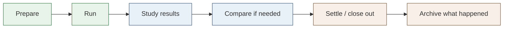
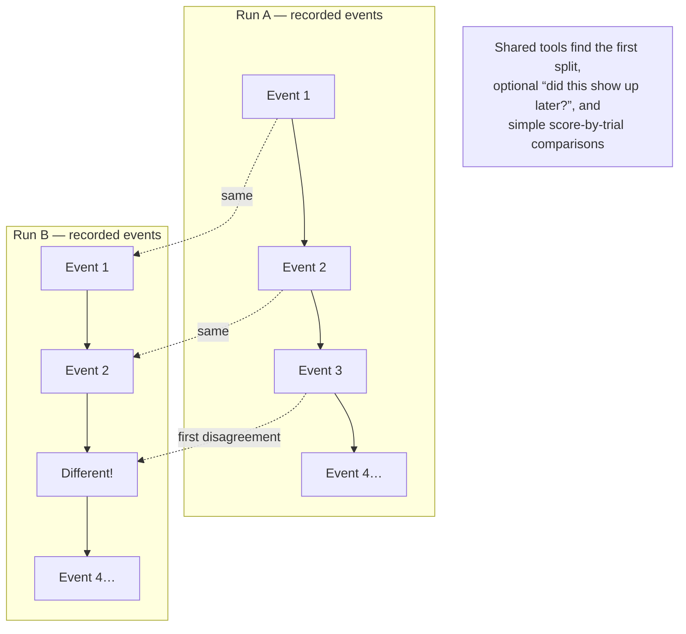
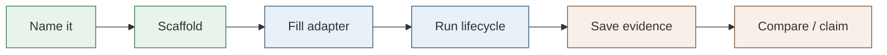

# Cogniverse Research Framework

A shared toolbox for running AI research experiments in a careful, repeatable way.

This project does **not** invent the science of any one experiment. It gives researchers a common place to run trials, save what happened, compare two runs, and check that claims are backed by evidence — so each new experiment does not have to rebuild those basics from scratch.

---

## Why this exists

AI research often looks like this:

1. Try an idea (a “strategy” or change).
2. Run many trials in a simulated world.
3. Look at the results and say something like: “this change helped.”
4. Later, someone asks: *Can we trust that? Can we replay it? What exactly changed?*

Without shared tools, every experiment invents its own way to answer those questions. Results get hard to compare. Small details get lost. Two people can mean different things by “the same run.”

This framework is the shared layer underneath that work. The **learning lab** (a separate project) holds the actual experiment ideas, numbers, and claims. This package holds the reusable machinery.

```text
  Learning lab                         This framework
  (your experiment ideas)              (shared tools)
  ┌─────────────────────┐              ┌──────────────────────────┐
  │  “Try strategy X”   │              │  Run an experiment       │
  │  specific seeds     │  ─────────►  │  Save results safely     │
  │  claim names        │   uses       │  Replay & compare runs   │
  │  scores & timings   │              │  Check claims vs evidence│
  └─────────────────────┘              └──────────────────────────┘
```

---

## What you can do with it

In plain terms, the framework helps you:

- **Run an experiment end to end** — prepare, execute, study the outcome, wrap up, and keep a record.
- **Save evidence** — store outputs so you can point back to them later (“here is the file that supports this claim”).
- **Replay without re-rolling the world** — look at recorded events again, instead of calling the simulator again and getting a different story.
- **Compare two versions** — spot where path A and path B first disagree, or which trial numbers changed after a tweak.
- **Keep science out of the toolbox** — experiment-specific details (which seed, which claim wording) stay in the lab and get passed in when needed.

The first real experiment it was built to support is **EXP-042** from the cogniverse learning lab. The adapter here is a thin demo of the contract — not a copy of that experiment’s science.

---

## How a run moves through the system

Think of each experiment as walking through a short checklist:



| Step | Everyday meaning |
| --- | --- |
| Prepare | Is everything ready? Do we have what we need before starting? |
| Run | Actually carry out the trial (through a small adapter for that experiment). |
| Study results | Summarize what happened. |
| Compare | If you have a “before” and “after,” find what changed. |
| Settle / archive | Mark the run finished and keep the record. |

---

## Looking at two runs side by side

A lot of the framework’s value is in **replay and compare**: you already have two recorded stories, and you want to know where they parted ways.



You bring the recorded events and scores. The framework does the bookkeeping: shared prefix, first difference, later matches, and side-by-side trial tables.

When some trial numbers keep failing, you can also ask: *what is different about those seeds?* Build a `SeedProfile` per seed (metrics + milestone timings from archived evidence), then call `diagnose_seed_failures` to contrast the hard cohort against successes. The framework reports which metrics cleanly separate them; the lab decides what that means scientifically.

---

## Who owns what

| This framework owns | The learning lab owns |
| --- | --- |
| Shared run lifecycle | The research question and hypothesis |
| Saving and hashing evidence | Specific seeds, timings, and claim wording |
| Replay / compare / seed-failure diagnosis helpers | Interpreting what a difference *means* scientifically |
| Thin adapters as plugs for experiments | Filling those plugs with real experiment data |

More detail for contributors: [docs/ARCHITECTURE.md](docs/ARCHITECTURE.md).

---

## Install

Current version: **0.2.1** (see `pyproject.toml`).

**On your machine, while developing against a local copy:**

```bash
pip install -e /path/to/cogniverse-research-framework
```

**For automated builds that must stay stable**, pin a release tag or a specific commit — do not float on an ever-changing default branch if you need a particular set of tools:

```bash
pip install "cogniverse-research-framework @ git+https://github.com/<org>/cogniverse-research-framework.git@v0.2.0"
```

```bash
pip install "cogniverse-research-framework @ git+https://github.com/<org>/cogniverse-research-framework.git@<commit-sha>"
```

Until a tag is published for a change you need, use the editable install above, or pin the merge commit after that change lands.

---

## Starting a new experiment

Science stays in the **learning lab**. Here you create a **plug (adapter)**, run it through the shared checklist, and keep evidence.

```text
Idea (lab) → scaffold files → write adapter → run → save evidence → compare / claim
```



### 1. Name it

Pick an id (for example `exp043`). Keep claim names, seeds, and scores in the lab — you will pass them in later.

### 2. Scaffold the starter files

```bash
python -m cogniverse_framework.cli.create_experiment exp043 --type replay
```

Allowed `--type` values: `replay`, `replay-analysis`, `audit`, `simulation`.

This creates `experiments/exp043/` with:

| File | Purpose |
| --- | --- |
| `manifest.yaml` | Id, type, audit rules |
| `adapter.py` | Stub with a `run()` method |
| `run.sh` | Thin launcher |
| `tests/test_generated.py` | Placeholder test |
| `generation.json` | Record of what was generated |

### 3. Fill the adapter (keep science injectable)

Replace the stub with a real adapter. Prefer subclassing `ExperimentAdapter` and accepting lab data as constructor arguments (same idea as EXP-042):

```python
from cogniverse_framework.experiments.base_adapter import ExperimentAdapter
from cogniverse_framework.research import ReplaySession
from cogniverse_framework.replay import compare_seed_matrix


class Exp043Adapter(ExperimentAdapter):
    experiment_id = "exp043"

    def __init__(
        self,
        replay_events=None,
        *,
        seed=0,
        baseline_scores=None,
        candidate_scores=None,
        learning_evidence=None,
    ):
        self.replay_events = list(replay_events or [])
        self.seed = seed
        self.baseline_scores = dict(baseline_scores or {})
        self.candidate_scores = dict(candidate_scores or {})
        self._learning_evidence = dict(learning_evidence or {})

    def execute(self):
        contract = ReplaySession(
            seed=self.seed,
            events=self.replay_events,
        ).validate_replay_only()

        mutation = compare_seed_matrix(
            self.baseline_scores,
            self.candidate_scores,
        )

        return {
            "experiment": self.experiment_id,
            "status": "COMPLETE",
            "contract": contract,
            "mutation_analysis": mutation.to_dict(),
            "learning_evidence": dict(self._learning_evidence),
        }

    def collect_learning_evidence(self, result):
        return result.get("learning_evidence", {})

    # ExperimentAdapter.run() already does: preflight → execute → analyze → evidence
```

Do **not** hardcode seeds, timings, or claim strings inside the framework package; pass them from the lab when you construct the adapter.

### 4. Run it

**Direct (recommended while developing):**

```python
from experiments.exp043.adapter import Exp043Adapter  # or your import path

result = Exp043Adapter(
    replay_events=[{"observation": "state"}],
    seed=42,
    baseline_scores={1: 100, 2: 200},
    candidate_scores={1: 100, 2: 210},
    learning_evidence={
        "strategy": "my_lab_strategy_name",
        "supporting_states": ["state_a"],
        "confidence": 0.75,
    },
).run()

print(result["execution"]["status"])
print(result["learning_evidence"])
```

**Through the shared engine** (prepare → run → study → settle):

```python
from cogniverse_framework.execution.engine import ExecutionEngine

outcome = ExecutionEngine(Exp043Adapter(seed=42)).run()
print(outcome["status"])   # COMPLETE
print(outcome["phases"])   # preflight / execute / analyze / settle
```

**Optional:** register the adapter on `ExperimentRunner.ADAPTERS` (today only `"exp042"` is built in) if you want `ExperimentRunner("exp043").run(folder)`.

### 5. Save evidence, then compare or claim

```python
from cogniverse_framework.evidence import EvidenceStore
from cogniverse_framework.replay import compare_seed_matrix
from cogniverse_framework.claims import LearningClaim

EvidenceStore("./evidence/exp043").write("result.json", result)

matrix = compare_seed_matrix({1: 100}, {1: 110})
claim = LearningClaim("my_lab_strategy_name", 0.75, ["state_a"])
assert claim.validate()["valid"]
```

### Checklist

| Step | Done when |
| --- | --- |
| Named | You have a stable `experiment_id` |
| Scaffolded | `experiments/<id>/` exists (or you copied the EXP-042 pattern) |
| Adapter filled | `execute`/`run` returns results; lab data is injected |
| Runnable | Direct `.run()` or `ExecutionEngine` succeeds |
| Evidence kept | Results written (and hashed) under an evidence folder |
| Science still in the lab | No hardcoded seeds/claims inside the framework |

Two common starting paths:

| Path | When to use it |
| --- | --- |
| **Generator** (`create_experiment`) | You want a new folder under `experiments/` |
| **Copy the EXP-042 pattern** | You want the thinner inject-data adapter style the lab already uses |

---

## How to use this library

After install, import from `cogniverse_framework`. Below is one short example per common job. Numbers and claim names stand in for **your** lab data — pass your own.

### 1. Run an experiment (adapter, with your data)

```python
from cogniverse_framework.experiments.exp042 import Exp042Adapter

result = Exp042Adapter(
    replay_events=[{"observation": "state"}],
    seed=51005,
    baseline_scores={51003: 376, 51004: 305},
    candidate_scores={51003: 382, 51004: 311},
    learning_evidence={
        "strategy": "prefer_promising_branches",
        "supporting_states": ["cb148158", "790ffc07"],
        "confidence": 0.8,
    },
).run()

print(result["status"])                              # COMPLETE
print(result["contract"]["valid"])                   # True if no env reset/step
print(result["mutation_analysis"]["changed_count"])  # how many trials shifted
```

### 2. Run an experiment and save files to disk

```python
from cogniverse_framework.integration import ExperimentRunner

outcome = ExperimentRunner("exp042").run("./artifacts/exp042-run")

print(outcome["experiment"])         # exp042
print(outcome["result"]["status"])   # COMPLETE
print(outcome["artifact_manifest"])  # files saved under that folder
```

> Note: `ExperimentRunner` currently builds a default `Exp042Adapter()` (empty science inputs). For real lab numbers, prefer example 1.

### 3. Check that a recording is “replay only”

```python
from cogniverse_framework.research import ReplaySession

session = ReplaySession(
    seed=42,
    events=[
        {"observation": "hallway"},
        # bad: {"step_called": True} would fail the check
    ],
)

check = session.validate_replay_only()
print(check["valid"])        # True
print(check["violations"])   # []
```

### 4. Compare scores across trials (before vs after)

```python
from cogniverse_framework.replay import compare_seed_matrix

matrix = compare_seed_matrix(
    baseline={1: 100, 2: 200, 3: 300},
    candidate={1: 100, 2: 210, 3: 300},
)

print(matrix.changed_seeds)  # [2]
print(matrix.changed_count)  # 1
print(matrix.to_dict())      # JSON-friendly dict if you need to save it
```

### 5. Find where two event sequences first disagree

```python
from cogniverse_framework.replay import (
    audit_sequence_divergence,
    classify_transition_divergence,
)

run_a = [
    {"before_state_id": "s0", "action_id": 0, "after_state_id": "s1"},
    {"before_state_id": "s1", "action_id": 1, "after_state_id": "s2"},
]
run_b = [
    {"before_state_id": "s0", "action_id": 0, "after_state_id": "s1"},
    {"before_state_id": "s1", "action_id": 2, "after_state_id": "s9"},
]

audit = audit_sequence_divergence(
    run_a,
    run_b,
    identity=lambda e: (e["before_state_id"], e["action_id"], e["after_state_id"]),
    classify=classify_transition_divergence,
)

print(audit.identical)                      # False
print(audit.shared_length)                  # 1
print(audit.divergence.index)               # 1
print(audit.divergence.classification)      # different_action_same_state
print(audit.left_divergent_later_in_right)  # LaterLookup(...)
```

### 6. Compare shared ancestry (path prefixes)

```python
from cogniverse_framework.replay import (
    shared_ancestry,
    first_reach_parents,
    ancestry_path,
)

shared = shared_ancestry(["root", "a", "b", "c"], ["root", "a", "x", "y"])
print(shared.shared_length)  # 2
print(shared.shared_states)  # ("root", "a")

parents = first_reach_parents([("root", "a"), ("a", "b")], root="root")
print(ancestry_path(parents, "b"))  # ["root", "a", "b"]
```

### 7. Save evidence with a fingerprint

```python
from cogniverse_framework.evidence import EvidenceStore, RunRecord

record = RunRecord("exp042", "COMPLETE").create()
print(record["run_id"])  # short id derived from the record contents

stored = EvidenceStore("./evidence").write("result.json", {"ok": True, "score": 12})
print(stored["path"])
print(stored["sha256"])
```

### 8. State a claim and link it to supporting states

```python
from cogniverse_framework.claims import LearningClaim, EvidenceLinker

claim = LearningClaim(
    strategy="prefer_promising_branches",
    confidence=0.8,
    supporting_states=["state_a", "state_b"],
)
print(claim.validate()["valid"])  # True

linked = EvidenceLinker().build(
    strategy="prefer_promising_branches",
    evidence_states=["state_a", "state_b"],
    failures=["state_c"],
)
print(linked["confidence"])  # 0.667  (2 supports / 3 total)
```

### 9. Pull a strategy hint from a short trajectory

```python
from cogniverse_framework.learning.extractor import BehaviorExtractor
from cogniverse_framework.replay import Trajectory, Transition

trajectory = Trajectory()
trajectory.add(Transition("state_a", "continue_branch", "success"))

print(BehaviorExtractor().extract(trajectory)["strategy"])
# continue_successful_branch

print(
    BehaviorExtractor(
        continue_branch_strategy="prefer_promising_branches",
    ).extract(trajectory)["strategy"]
)
# prefer_promising_branches
```

### Quick map: task → starting point

| What you want to do | Start here |
| --- | --- |
| Run with your seeds / scores / claims | `Exp042Adapter(...).run()` |
| Run and write artifact files | `ExperimentRunner("exp042").run(folder)` |
| Prove a log did not re-call the world | `ReplaySession(...).validate_replay_only()` |
| See which trials changed | `compare_seed_matrix(...)` |
| Find first split between two logs | `audit_sequence_divergence(...)` |
| Shared path prefix / parent chain | `shared_ancestry`, `ancestry_path` |
| Save a result + hash | `EvidenceStore(...).write(...)` |
| Attach a claim to evidence | `LearningClaim`, `EvidenceLinker` |
| Label a short success path | `BehaviorExtractor` |
