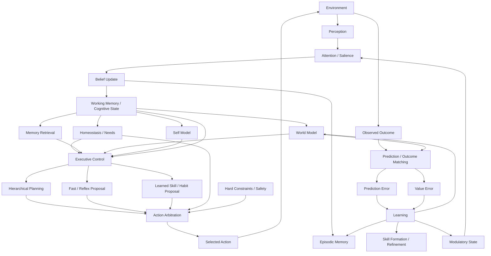

# Brain-Inspired Cognitive Architecture for Cogniverse

**Repository:** `cogniverse-research-framework`  
**Document purpose:** Map major functional systems of the human brain to reusable Cogniverse computational subsystems, define how those subsystems communicate, and guide incremental evolution of the framework into a brain-inspired cognitive architecture research substrate.  
**Status:** Architectural design guidance, not a claim that software modules literally reproduce brain regions.  
**Date:** 2026-08-26

---

## 1. Purpose

Cogniverse is evolving from a task-solving agent framework toward a research platform for studying an artificial cognitive organism.

The central architectural hypothesis is:

> Intelligence may emerge more effectively from multiple specialized, interacting cognitive systems than from a single monolithic controller or LLM.

The framework should therefore provide reusable contracts, lifecycle machinery, communication protocols, evidence capture, and reference implementations for cognitive subsystems such as:

- perception;
- attention and salience;
- beliefs and uncertainty;
- working memory;
- episodic, semantic, and procedural memory;
- homeostasis and needs;
- value and safety;
- world modeling and prediction;
- executive control;
- planning;
- action arbitration;
- skill formation;
- prediction-error learning;
- credit assignment;
- self-modeling;
- social cognition;
- modulatory state;
- language/LLM interfaces.

The Learning Lab should remain responsible for scientific hypotheses, environment-specific implementations, experiment protocols, value configurations, seeds, thresholds, and claims.

The framework should own reusable machinery.

---

## 2. Important principle: copy computational ideas, not anatomy

Cogniverse should be **brain-inspired**, not a literal software replica of brain anatomy.

Avoid code such as:

```text
hippocampus.py
amygdala.py
prefrontal_cortex.py
basal_ganglia.py
```

as the primary architecture.

Brain regions:

- perform multiple functions;
- interact in loops rather than simple pipelines;
- have overlapping responsibilities;
- are still incompletely understood;
- do not map cleanly to software objects.

Instead use:

```text
brain observation
      ↓
computational principle
      ↓
Cogniverse subsystem
```

Example:

```text
Hippocampal rapid episodic learning
      ↓
fast storage of contextual experiences
      ↓
EpisodicMemoryStore / EpisodicMemoryPort
```

The neuroscience mapping belongs in architecture documentation and research rationale.

The software API should be named by **computational responsibility**.

---

## 3. What should not be copied

### 3.1 Do not build a fake left-brain/right-brain split

The popular idea that the left hemisphere is logical/language and the right hemisphere is creative/intuitive is too simplistic for software architecture.

An LLM should therefore **not** be called the "left brain", and the remaining architecture should not be called the "right brain".

A better model is:

```text
LLM = optional language + abstraction + hypothesis subsystem

Cognitive organism =
    perception
  + memory
  + values
  + prediction
  + executive control
  + planning
  + arbitration
  + learning
  + language
  + other specialized systems
```

### 3.2 Do not create one omnipotent executive controller

There should not be a `GodController.decide_everything()` object.

Human cognitive control appears distributed across interacting cortical and subcortical systems.

Cogniverse should similarly distribute control among:

- salience;
- homeostatic pressure;
- goals;
- working memory;
- planning;
- habits/skills;
- arbitration;
- safety constraints;
- modulatory signals.

### 3.3 Do not make all modules communicate through English

Natural language is an interface representation, not the nervous system of Cogniverse.

The control path should use typed state, references, events, vectors, scores, distributions, and explicit provenance.

### 3.4 Do not reduce all motivation to one scalar reward

A single scalar:

```text
reward = 0.83
```

cannot cleanly express:

- survival;
- safety;
- resource sufficiency;
- uncertainty reduction;
- curiosity;
- cooperation;
- long-term risk;
- hard prohibitions.

Scalar rewards may remain supported through explicit compatibility adapters, but they should not become the foundation of the new architecture.

---

# 4. Neuroscience-to-Cogniverse functional mapping

The table below is intentionally approximate.

A biological structure is listed as **inspiration**, not as a claim that the software function is neurologically localized only there.

| Neuroscience inspiration | Simplified biological role | Cogniverse computational responsibility | Proposed reusable framework concept |
|---|---|---|---|
| Sensory cortex | Extract useful structure from sensory signals | Perception and feature extraction | `Percept`, `PerceptionPort`, modality adapters |
| Thalamocortical systems | Routing, gating, gain modulation | Cognitive routing and selective information admission | `SignalBus`, `AttentionGate`, routing policy |
| Amygdala / limbic circuits | Relevance, threat, affective salience | Salience and rapid threat/value tagging | `SalienceEstimate`, `ThreatSignal`, `SaliencePolicy` |
| Insula / interoceptive systems | Internal-body-state representation | Internal-state sensing | `InteroceptiveState`, `NeedObservation` |
| Hypothalamic systems | Homeostasis and survival regulation | Needs, deficits, survival pressures | `NeedState`, `HomeostaticState`, `HomeostaticUpdate` |
| Hippocampal systems | Rapid contextual/episodic learning | Episodic memory and contextual retrieval | `EpisodicMemoryRecord`, `EpisodicMemoryPort` |
| Neocortical learning | Slow distributed generalization | Semantic knowledge and generalized representations | `SemanticMemoryRecord`, semantic consolidation |
| Prefrontal networks | Working memory, goals, control | Working state, goal maintenance, executive policy | `WorkingMemory`, `GoalState`, `ExecutivePolicy` |
| Anterior cingulate / medial frontal systems | Conflict, error, performance monitoring | Conflict detection, uncertainty escalation, replan triggers | `ConflictSignal`, `PerformanceMonitor` |
| Orbitofrontal/value-related networks | Outcome/value representation | Contextual value estimation | `ValueEstimate`, `OutcomeEstimate` |
| Basal ganglia loops | Gating, action selection, habit expression | Action arbitration and learned policy/skill gating | `ActionProposal`, `ArbitrationPolicy`, `SelectedAction` |
| Cerebellar systems | Forward prediction, timing, error-driven refinement | Fast prediction and procedural refinement | `ForwardPrediction`, `PredictionError`, skill refinement ports |
| Dopaminergic systems | Reward prediction-error-related learning signals | Value-error learning modulation | `ValueError`, learning-update modulation |
| Locus coeruleus / norepinephrine | Arousal, gain, exploration/focus modulation | Global cognitive modulation | `ModulatoryState`, `Arousal`, `ExplorationBias` |
| Language networks | Language comprehension and production | Human communication and language-mediated hypothesis generation | `LanguageInterface`, `LLMAdapter` |
| Social cognition networks | Modeling others' beliefs, goals, intentions | Other-agent models and theory of mind | `AgentModel`, `SocialBelief`, `TrustEstimate` |
| Distributed self-related networks | Self-representation, autobiographical integration | Self-model and metacognition | `SelfModel`, `CapabilityEstimate`, `MetaConfidence` |
| White-matter connectivity | Long-range communication | Typed communication infrastructure | contracts, references, signal transport, provenance |

---

# 5. Detailed subsystem mapping

## 5.1 Perception

### Biological inspiration

Sensory systems convert large volumes of raw input into progressively more useful representations.

The useful computational lesson is not "copy visual cortex layers exactly." It is:

> Raw environment data should not directly enter planning and reasoning.

### Cogniverse responsibility

Perception converts environment-specific observations into environment-neutral or partially normalized perceptual records.

Example:

```text
raw Craftax observation
        ↓
environment adapter
        ↓
PublicPercept
        ↓
perception subsystem
        ↓
candidate entities / events / relations
```

### Framework should own

- generic percept contracts;
- provenance;
- confidence representation;
- modality-independent references;
- validation;
- deterministic serialization;
- perception ports.

### Learning Lab should own

- Craftax tile interpretation;
- MiniGrid semantics;
- environment-specific feature extraction;
- experimental perception algorithms.

### Communication

Perception primarily produces:

- percept events;
- candidate beliefs;
- salience inputs;
- evidence references.

It should not directly select actions.

---

## 5.2 Attention and salience

### Biological inspiration

Brains cannot deeply process every signal simultaneously.

Attention and salience systems bias processing toward information that is:

- threatening;
- novel;
- goal-relevant;
- surprising;
- uncertain;
- potentially rewarding;
- internally urgent.

### Cogniverse responsibility

The attention system decides what receives limited cognitive resources.

Example:

```text
100 percepts
   ↓
salience scoring
   ↓
12 candidates
   ↓
attention gating
   ↓
4 items enter working memory
```

### Salience is not the same as executive control

Salience answers:

> What deserves processing?

Executive control answers:

> Given the currently relevant state, what cognitive operation should be performed?

### Proposed contracts

```text
SalienceEstimate
AttentionCandidate
AttentionDecision
AttentionGate
ThreatSignal
NoveltySignal
```

A `SalienceEstimate` could contain dimensions rather than one unexplained scalar:

```text
threat
goal_relevance
novelty
uncertainty
expected_information_gain
homeostatic_relevance
```

### Research questions

- Does explicit salience improve survival under limited compute?
- Does novelty-based attention accelerate learning?
- When should threat override current planning?
- Can attention itself be learned?

---

## 5.3 Interoception, needs, and homeostasis

### Biological inspiration

The nervous system continuously monitors internal conditions.

The hypothalamus and related systems help regulate variables needed for survival.

The important computational lesson is:

> Goals do not need to originate only from external tasks.

An artificial organism can generate priorities because its internal state deviates from desired operating ranges.

### Cogniverse responsibility

Represent:

```text
current internal level
target/range
deficit
urgency
trend
confidence
provenance
```

Example:

```yaml
need: energy
level: 0.22
target_minimum: 0.60
deficit: 0.38
urgency: high
```

### Proposed contracts

```text
NeedState
HomeostaticState
HomeostaticUpdate
NeedPressure
InteroceptiveObservation
```

### Important distinction

`NeedState` is descriptive.

`NeedPressure` is motivational.

`Goal` is an intended objective.

These should not collapse into one field.

For example:

```text
NeedState:
    food deficit = high

NeedPressure:
    restore energy = urgent

Goal:
    obtain food source

Plan:
    travel → gather → consume
```

That separation will make ablation experiments much cleaner.

---

## 5.4 Value and safety system

### Biological inspiration

Brains contain multiple interacting valuation and defensive systems rather than one universal "reward number".

### Cogniverse responsibility

Cogniverse should distinguish:

1. **Hard constraints**
2. **Safety/risk assessments**
3. **Homeostatic value**
4. **Goal value**
5. **Social/cooperative value**
6. **Information value**
7. **Efficiency costs**

A useful hierarchy is:

```text
HARD CONSTRAINTS
      ↓
SAFETY / CATASTROPHIC RISK
      ↓
SURVIVAL / HOMEOSTASIS
      ↓
ACTIVE GOALS
      ↓
SOCIAL / COOPERATIVE VALUE
      ↓
CURIOSITY / INFORMATION GAIN
      ↓
EFFICIENCY
```

This is not necessarily a strict global priority ordering for every experiment. The framework should support the representation; the Learning Lab should inject the specific policy being tested.

### Why hard constraints must be separate

Do not implement:

```python
score = (
    0.4 * user_survival
    + 0.4 * humanity_survival
    + 0.2 * curiosity
)
```

A sufficiently large value in one term could mathematically compensate for an unacceptable outcome elsewhere.

Instead:

```text
candidate action
      ↓
hard constraint evaluation
      ↓
if allowed:
    estimate multidimensional value
      ↓
    arbitration
```

### Individual survival and humanity safety

The framework should be capable of representing safety at multiple scopes:

```text
SELF
USER
OTHER_AGENT
GROUP
HUMANITY
ENVIRONMENT
```

However, the framework should **not hard-code one universal interpretation** of "humanity survival" or "user survival".

Those semantics belong in policy/configuration layers and research protocols.

The reusable framework should provide:

```text
ConstraintScope
HardConstraint
ConstraintEvaluation
RiskEstimate
ValueVector
ValueEstimate
```

---

## 5.5 Belief state and uncertainty

### Biological inspiration

An intelligent system must distinguish sensory evidence from inferred state.

### Cogniverse responsibility

The organism should differentiate:

```text
observation
belief
hypothesis
prediction
known unknown
confidence
```

Example:

```text
Observation:
    motion observed near tree

Belief:
    hostile entity may be near tree
    confidence = 0.64

Prediction:
    approaching tree may cause combat
    probability distribution = ...

Unknown:
    exact entity type
```

### Proposed contracts

```text
Belief
BeliefRef
BeliefUpdate
EvidenceLink
UncertaintyEstimate
Hypothesis
```

### Requirements

- beliefs require provenance;
- uncertainty must be explicit;
- absence of evidence must not silently become false;
- beliefs should be revisable;
- predictions must not automatically become beliefs;
- LLM-generated hypotheses must be marked hypothetical.

---

## 5.6 Working memory

### Biological inspiration

Working memory provides limited temporary access to task-relevant information.

### Cogniverse responsibility

Do not allow `CognitiveState` to become an infinitely expanding global dictionary.

Working memory should be deliberately bounded.

It can contain:

- current goal;
- current subgoal;
- recent salient percepts;
- active hypotheses;
- active retrieved memories;
- current plan;
- unresolved conflict;
- current uncertainty.

### Proposed contracts

```text
WorkingMemoryItem
WorkingMemoryState
WorkingMemoryAdmission
WorkingMemoryEviction
WorkingMemoryPort
```

### Research questions

- What capacity works best?
- What should be evicted?
- Should emotional/homeostatic relevance preserve an item?
- Does limited working memory improve generalization by forcing compression?

---

## 5.7 Episodic memory

### Biological inspiration

Hippocampal systems support rapid acquisition of contextual experiences.

### Cogniverse responsibility

Episodic memory stores:

> What happened in a specific experience?

Example:

```yaml
time: step_431
context:
  location: cave
  energy: low
event:
  action: enter_cave
outcome:
  hostile_encounter: true
  damage: 0.31
```

### Proposed contracts

```text
EpisodicMemoryRecord
EpisodeContext
EpisodeOutcome
EpisodicRetrievalQuery
EpisodicRetrievalResult
```

### Important

An episodic memory should remain distinct from a semantic rule inferred from many episodes.

---

## 5.8 Semantic memory

### Biological inspiration

Complementary-learning-systems theories distinguish rapid episodic learning from slower integration of generalized structure.

### Cogniverse responsibility

Semantic memory represents generalized knowledge:

```text
"caves frequently contain hostile entities"
```

rather than:

```text
"at step 431 I entered one cave and encountered an enemy"
```

### Proposed contracts

```text
SemanticMemoryRecord
Concept
Relation
Rule
SemanticEvidence
SemanticUpdate
```

### Consolidation

A consolidation mechanism may transform:

```text
episodes
   ↓
pattern extraction
   ↓
candidate semantic knowledge
   ↓
validation / confidence update
   ↓
semantic memory
```

This is a major opportunity for Cogniverse research.

---

## 5.9 Procedural memory and skills

### Biological inspiration

Repeated behavior can become increasingly automatic and efficient.

Basal-ganglia and cerebellar systems contribute to different aspects of learned action and skill execution.

### Cogniverse responsibility

Procedural memory represents:

> How do I perform a reusable behavior?

Example:

```text
primitive sequence:
    find wood
    gather wood
    move
    gather stone
    craft
    place

becomes:
    build_shelter
```

### Proposed contracts

```text
Skill
SkillGraph
SkillPrecondition
SkillOutcome
SkillReliability
SkillExecution
SkillFormationRecord
SkillRefinement
```

### Hierarchical abstraction

Planning should operate across levels:

```text
survive_night
      ↓
build_shelter
      ↓
acquire_materials
      ↓
move_north
      ↓
primitive environment action
```

This is essential for scaling beyond short action sequences.

---

## 5.10 Memory consolidation, replay, forgetting, and compression

A brain-inspired memory architecture should not retain every experience forever at equal importance.

Cogniverse should eventually support:

```text
experience
    ↓
episodic memory
    ↓
replay / consolidation
    ↓
semantic pattern
    ↓
procedural skill
```

and:

```text
low relevance / low utility / redundancy
    ↓
compression or forgetting
```

### Proposed contracts

```text
ConsolidationRequest
ConsolidationResult
ReplayCandidate
MemoryCompressionRecord
MemoryTombstone
ForgettingDecision
```

### Framework requirement

All destructive or compressive operations should retain provenance sufficient to reconstruct what changed.

---

## 5.11 World model

### Biological inspiration

Brains continuously predict aspects of future sensory state and action consequences.

No single brain region is "the world model".

World modeling is distributed.

### Cogniverse responsibility

The world model estimates:

```text
P(future_state | current_state, action)
```

It should support:

- environmental dynamics;
- causal relationships;
- object persistence;
- threat evolution;
- resource dynamics;
- other-agent behavior;
- longer-horizon consequences.

### Proposed contracts

```text
WorldStateRef
Prediction
PredictionSet
OutcomeDistribution
PredictionHorizon
WorldModelPort
```

### Important

A world-model prediction is not an empirical event.

The architecture must preserve:

```text
prediction ≠ observation
simulation ≠ evidence
hypothesis ≠ fact
```

---

## 5.12 Forward models and cerebellar inspiration

The broad world model and a fast forward model should not necessarily be identical.

A cerebellum-inspired subsystem can focus on rapid prediction of consequences for well-practiced operations.

Example:

```text
planned action
    ↓
fast forward prediction
    ↓
expected near-term sensory/outcome state
    ↓
execute
    ↓
compare actual
    ↓
prediction error
    ↓
refine skill/controller
```

This can eventually support fast learned competence without invoking a general planner for every low-level operation.

### Proposed contracts

```text
ForwardPrediction
PredictionMatch
PredictionError
ControllerUpdate
SkillRefinement
```

---

## 5.13 Prediction error

Prediction error is central to the architecture.

The generic pattern is:

```text
prediction
     ↓
action / time
     ↓
actual observation
     ↓
matching
     ↓
error
     ↓
learning update
```

Prediction error should be structured.

Not:

```text
error = 0.42
```

only.

Potential dimensions include:

```text
state feature error
timing error
resource error
threat error
action-effect error
confidence calibration error
```

### Proposed contracts

```text
PredictionMatch
PredictionError
PredictionErrorComponent
CalibrationRecord
ModelUpdateRecord
```

---

## 5.14 Value error and dopamine-inspired learning

Prediction error about the world and error about expected value are not the same.

Maintain:

```text
PredictionError
```

separately from:

```text
ValueError
```

Example:

```text
World prediction:
    "I will obtain food."

World result:
    food obtained.
Prediction error:
    small.

Expected value:
    "Food will restore 50% energy."

Actual value:
    restored 10%.
Value error:
    large negative.
```

This distinction will make learning mechanisms interpretable.

### Proposed contracts

```text
ExpectedValue
ObservedValue
ValueError
LearningModulation
```

---

## 5.15 Goal formation and executive control

### Biological inspiration

Prefrontal and related networks maintain goals, context, rules, and working information.

But there is no need to model a single executive homunculus.

### Cogniverse responsibility

Executive control should coordinate cognitive operations such as:

- maintain or change goal;
- request memory retrieval;
- request world-model simulation;
- escalate uncertainty;
- trigger replan;
- allocate more computation;
- switch between exploration and exploitation;
- stop a failing strategy.

### Proposed contracts

```text
Goal
GoalProposal
GoalPriority
ExecutiveState
CognitiveRequest
ControlTransition
ExecutivePolicy
```

### Executive policy should consume competing pressures

```text
homeostatic needs
+
salience
+
goal state
+
uncertainty
+
performance monitoring
+
available skills
+
current plan
```

It should not own those systems.

---

## 5.16 Conflict and performance monitoring

### Biological inspiration

Anterior-cingulate and medial-frontal systems are associated with conflict, errors, performance monitoring, and control demand.

### Cogniverse responsibility

A dedicated monitoring subsystem can detect:

```text
multiple incompatible action proposals
high uncertainty
repeated failed prediction
plan not progressing
resource consumption too high
belief contradiction
constraint risk
```

### Proposed contracts

```text
ConflictSignal
PerformanceSignal
ControlDemand
ReplanTrigger
EscalationRequest
```

This makes "reflection" an explicit computational mechanism rather than an LLM prompt such as:

```text
"Think about whether you were wrong."
```

---

## 5.17 Planning

Planning transforms goals into candidate future action structures.

### Cogniverse responsibility

Support multiple horizons:

```text
Goal
  ↓
Strategy
  ↓
Plan
  ↓
Skill
  ↓
Primitive action
```

### Proposed contracts

```text
Plan
PlanNode
PlanEdge
PlanProposal
PlanStatus
PlanRevision
PlannerPort
```

Plans should link to:

- beliefs used;
- predictions used;
- memories retrieved;
- expected values;
- constraints checked;
- uncertainty;
- provenance.

This enables later causal analysis.

---

## 5.18 Action proposals and basal-ganglia-inspired arbitration

Multiple systems should be able to propose actions.

Example:

```text
homeostasis:
    EAT

threat response:
    RUN

planner:
    BUILD_SHELTER

curiosity:
    EXPLORE

habit:
    RETURN_TO_BASE
```

A separate arbitration system selects among them.

### Why this matters

If the planner always chooses the final action, all other cognitive systems become advice APIs around a hidden centralized controller.

Arbitration allows real competition between specialized systems.

### Proposed contracts

```text
ActionProposal
ProposalSource
ActionUtilityEstimate
ActionRiskEstimate
ArbitrationDecision
RejectedProposal
SelectedAction
```

### Arbitration sequence

```text
candidate proposals
      ↓
hard constraint filter
      ↓
urgency / interrupt checks
      ↓
contextual value comparison
      ↓
skill/reliability consideration
      ↓
selected action
```

---

## 5.19 Reflexes and fast pathways

Not every action should require:

```text
perception → LLM → planner → executive → arbitration
```

Survival requires fast responses.

The framework should eventually allow short circuits:

```text
high-confidence critical threat
       ↓
validated reflex policy
       ↓
action proposal with interrupt priority
       ↓
safety check
       ↓
arbitration
```

This remains auditable and constrained without requiring slow deliberation.

---

## 5.20 Neuromodulation

This is one of the most important additions to the earlier Cogniverse model.

Biological nervous systems contain signals that alter the behavior of many neural circuits without carrying a complete semantic message.

Cogniverse should support an analogous **modulatory channel**.

Potential modulators:

```text
arousal
attention gain
exploration bias
learning rate
novelty sensitivity
risk sensitivity
memory consolidation pressure
cognitive effort budget
```

### Proposed contracts

```text
ModulatoryState
ModulatorySignal
GainSetting
ExplorationBias
LearningRateSignal
ArousalState
```

### Example

```text
threat rises
   ↓
arousal ↑
exploration ↓
threat salience gain ↑
planning horizon ↓
reflex proposals gain priority
```

No English instruction is needed.

---

## 5.21 Curiosity and intrinsic motivation

If survival is the only objective, an organism can learn to become conservative and stop exploring.

Curiosity should therefore be represented separately.

Possible drivers:

```text
novelty
uncertainty
prediction surprise
expected information gain
skill-learning opportunity
```

### Proposed contracts

```text
NoveltyEstimate
InformationGainEstimate
CuriosityPressure
ExploreProposal
```

The Learning Lab should test whether intrinsic motivation improves long-term competence rather than assuming it does.

---

## 5.22 Credit assignment

A delayed outcome may result from actions taken many steps earlier.

Example:

```text
step 10: ignore food
step 30: explore cave
step 60: lose health
step 90: cannot escape enemy
step 100: die
```

Which earlier decisions deserve negative learning credit?

### Proposed contracts

```text
CreditAssignment
CreditTarget
TemporalCredit
CausalCandidate
CounterfactualCredit
```

Credit may target:

- action;
- plan;
- prediction;
- belief;
- memory;
- skill;
- goal;
- arbitration choice.

Do not make credit assignment equal only to assigning reward to the most recent action.

---

## 5.23 Self-model and metacognition

An intelligent organism benefits from representing itself.

Examples:

```text
"I have low energy."
"I am unreliable at combat."
"This prediction model is poorly calibrated."
"I do not know the map."
"This skill succeeds 92% of the time."
```

### Proposed contracts

```text
SelfState
CapabilityEstimate
ResourceEstimate
ModelReliability
MetaConfidence
SelfModelPort
```

### Important

The self-model is data about the system.

It should not require anthropomorphic consciousness claims.

---

## 5.24 Social cognition

Later Cogniverse phases can introduce explicit other-agent models.

Represent:

```text
other agent identity
observed behavior
inferred goal
inferred belief
trust
reliability
capability
relationship
uncertainty
```

### Proposed contracts

```text
AgentModel
SocialBelief
OtherAgentGoal
TrustEstimate
IntentHypothesis
```

This opens research into:

- cooperation;
- competition;
- negotiation;
- teaching;
- imitation;
- deception detection;
- collective survival.

---

## 5.25 Language and LLM interface

LLMs should remain **adjacent to cognition**, not the owner of cognition.

### Appropriate LLM roles

- interpret human language;
- generate explanations;
- summarize structured state;
- propose hypotheses;
- propose plans;
- suggest abstractions;
- translate internal concepts to language;
- translate language into candidate structured requests.

### Inappropriate direct privileges

An LLM response should not directly:

- mutate hard constraints;
- mark a hypothesis as fact;
- select an action;
- rewrite empirical history;
- create trusted memory without provenance;
- change core values;
- override arbitration;
- silently alter homeostasis.

### Architecture

```text
Human / language source
        ↓
Language interface
        ↓
LLM
        ↓
typed proposal / hypothesis
        ↓
validation
        ↓
appropriate cognitive subsystem
```

For output:

```text
CognitiveState / evidence
        ↓
read-only language view
        ↓
LLM
        ↓
human-readable explanation
```

The cognitive loop must remain runnable with no LLM installed.

---

# 6. Cogniverse communication architecture

The framework should not rely on one universal communication mechanism.

A useful brain-inspired abstraction is **three communication classes**.

---

## 6.1 Channel A: fast transient signals

Purpose:

> Something just happened and another subsystem may need to react.

Examples:

```text
percept arrived
threat detected
prediction failed
hard constraint at risk
action completed
plan stalled
unexpected event
```

Properties:

- event-like;
- immutable;
- small;
- timestamp/logical-step bound;
- provenance-bearing;
- optionally priority-tagged;
- replayable.

Possible framework types:

```text
CognitiveSignal
SignalKind
SignalPriority
SignalEnvelope
SignalBus
```

Do not treat this as a generic untyped event bus.

Signal payloads should remain versioned and typed.

---

## 6.2 Channel B: persistent cognitive state

Purpose:

> What is the currently relevant organized state of cognition?

The existing `CognitiveState` is a good foundation.

It currently acts as a small coordination snapshot containing references to:

- goals;
- needs;
- beliefs;
- predictions;
- memories;
- possible actions;
- hard constraints;
- uncertainty.

That design should remain **reference-based**.

Do not place entire world models, memory databases, or plans inside `CognitiveState`.

Think of it as:

```text
CognitiveState = cognitive workspace index
```

rather than:

```text
CognitiveState = entire brain
```

---

## 6.3 Channel C: modulatory signals

Purpose:

> Change how other systems process information.

Examples:

```text
increase threat sensitivity
increase learning rate
lower exploration
increase attention gain
reduce planning horizon
increase memory-consolidation priority
```

Properties:

- potentially longer-lived;
- may affect multiple subsystems;
- should be explicit;
- should be observable and replayable;
- should never be hidden global mutable state.

Possible types:

```text
ModulatoryState
ModulatorySignal
ModulationTarget
ModulationEffect
```

---

# 7. Representation levels

Different cognitive systems can operate with different representations.

A useful hierarchy:

```text
LEVEL 0
raw environment signals
pixels / audio / simulator state / sensors

        ↓ perception

LEVEL 1
features / embeddings / learned latent representations

        ↓ interpretation

LEVEL 2
typed percepts / entities / relations / events

        ↓ belief formation

LEVEL 3
beliefs / needs / predictions / memory refs / goals

        ↓ cognition

LEVEL 4
plans / action proposals / value estimates / learning updates

        ↓ language interface when needed

LEVEL 5
natural language
```

No rule says every subsystem must use every level.

For example:

- a vision encoder may communicate vectors;
- a belief system may communicate structured records;
- a planner may communicate graphs;
- an LLM may communicate language at the boundary;
- a prediction model may consume latent vectors internally but expose typed prediction records for audit.

---

# 8. Typed messages rather than one giant schema

Do not create:

```python
class UniversalBrainMessage:
    payload: dict[str, Any]
```

This destroys the primary research advantage of the framework.

Prefer:

```text
Percept
BeliefUpdate
MemoryRetrievalRequest
MemoryRetrievalResult
WorldModelQuery
PredictionSet
PlanProposal
ActionProposal
ArbitrationDecision
LearningUpdate
ModulatorySignal
```

Each contract should state:

1. owner;
2. producer;
3. consumers;
4. whether it is empirical, inferred, hypothetical, or control data;
5. schema version;
6. logical time;
7. provenance;
8. confidence/uncertainty if relevant;
9. serialization guarantees;
10. invalid/private-input behavior.

---

# 9. Proposed reusable framework structure

This is a **directional package architecture**.

Do not create empty packages merely to match this diagram.

Add modules only when the current research phase needs them.

```text
src/cogniverse_framework/
│
├── cognition/
│   ├── state.py
│   ├── perception.py
│   │
│   ├── attention/
│   │   ├── salience.py
│   │   └── gating.py
│   │
│   ├── beliefs/
│   │   ├── models.py
│   │   ├── uncertainty.py
│   │   └── ports.py
│   │
│   ├── memory/
│   │   ├── working.py
│   │   ├── episodic.py
│   │   ├── semantic.py
│   │   ├── procedural.py
│   │   ├── consolidation.py
│   │   └── ports.py
│   │
│   ├── value/
│   │   ├── constraints.py
│   │   ├── values.py
│   │   ├── needs.py
│   │   ├── homeostasis.py
│   │   └── ports.py
│   │
│   ├── prediction/
│   │   ├── prediction.py
│   │   ├── world_model.py
│   │   ├── matching.py
│   │   ├── errors.py
│   │   └── ports.py
│   │
│   ├── control/
│   │   ├── goals.py
│   │   ├── executive.py
│   │   ├── planning.py
│   │   ├── arbitration.py
│   │   └── ports.py
│   │
│   ├── learning/
│   │   ├── updates.py
│   │   ├── credit.py
│   │   ├── skills.py
│   │   └── ports.py
│   │
│   ├── modulation/
│   │   ├── state.py
│   │   ├── signals.py
│   │   └── ports.py
│   │
│   ├── self_model/
│   │   ├── models.py
│   │   └── ports.py
│   │
│   ├── social/
│   │   ├── models.py
│   │   └── ports.py
│   │
│   └── language/
│       ├── models.py
│       ├── llm.py
│       └── ports.py
│
├── runtime/
│   ├── cognitive_cycle.py
│   ├── signal_bus.py
│   ├── modulation.py
│   └── traces.py
│
├── contracts/
├── evidence/
├── replay/
├── execution/
├── analysis/
├── environments/
├── integration/
└── adapters/
```

---

# 10. Why `cognition/` should contain domain concepts and `runtime/` should contain coordination

This distinction is important.

## `cognition/`

Owns:

```text
what a belief is
what a need is
what a prediction is
what an action proposal is
what an arbitration decision is
```

## `runtime/`

Owns:

```text
when subsystems are invoked
how signals are delivered
how one cognitive cycle is traced
how modulatory state is distributed
how deterministic replay reconstructs coordination
```

This prevents a cognitive concept from becoming coupled to one orchestration implementation.

---

# 11. Ports before implementations

The reusable framework should preferentially define ports such as:

```python
class EpisodicMemoryPort(Protocol):
    def store(...): ...
    def retrieve(...): ...

class WorldModelPort(Protocol):
    def predict(...): ...

class PlannerPort(Protocol):
    def propose_plan(...): ...

class ArbitrationPort(Protocol):
    def select(...): ...
```

The Learning Lab can then test different implementations without changing the rest of the cognitive organism.

Examples:

```text
EpisodicMemoryPort
    ├── in-memory reference implementation
    ├── graph-backed implementation
    ├── vector retrieval implementation
    └── experimental learned retrieval implementation
```

A vector database is therefore a backend.

It is **not** the definition of memory.

---

# 12. Cognitive cycle

A default reusable cognitive cycle can be expressed as:



This should be treated as a reference cycle, not a requirement that all experiments use every subsystem.

---

# 13. The cognitive cycle must allow shortcuts

A brain-inspired architecture should not require all modules on every step.

Examples:

### Reactive path

```text
perception
→ threat
→ fast action proposal
→ constraints
→ arbitration
→ action
```

### Habitual path

```text
perception
→ known context
→ procedural skill
→ arbitration
→ action
```

### Deliberative path

```text
perception
→ belief
→ memory
→ world model
→ planner
→ arbitration
→ action
```

### Language-assisted path

```text
cognitive state
→ LLM hypothesis request
→ typed hypothesis
→ validation
→ planner/world model
→ arbitration
```

The research question becomes:

> When should each pathway dominate?

---

# 14. Cognitive state should stay small

The existing `CognitiveState` direction is correct.

It should continue acting as a compact coordination snapshot.

A possible future shape:

```text
CognitiveState
    state_id
    logical_step

    active_goal_refs
    active_need_refs
    active_belief_refs
    active_memory_refs
    active_prediction_refs
    active_plan_ref
    action_proposal_refs

    uncertainty
    hard_constraint_refs
    modulatory_state_ref
    working_memory_ref
```

Avoid embedding:

```text
full memory histories
full semantic graph
full world-model parameters
raw image data
LLM transcripts
entire plan history
```

Those belong to subsystem-owned stores referenced by stable IDs.

---

# 15. Provenance is Cogniverse's nervous-system trace

Every important cognitive transition should be reconstructable.

Example:

```text
percept P14
  ↓
produced belief B22
  ↓
retrieved memory M9
  ↓
world prediction W17
  ↓
planner produced plan PL4
  ↓
planner proposed action A10
  ↓
arbitrator selected A10
  ↓
outcome O55
  ↓
prediction error PE3
  ↓
model update MU8
```

This lineage should be first-class.

It enables:

- exact replay;
- causal analysis;
- ablation;
- debugging;
- audit;
- scientific comparison;
- explanation without trusting an LLM narrative.

---

# 16. Framework vs Learning Lab ownership

This boundary should remain strict.

## Research framework owns

Reusable, environment-neutral concepts:

- cognitive contracts;
- schema versions;
- validation;
- typed references;
- uncertainty representation;
- value-vector structure;
- hard-constraint structure;
- needs/homeostasis contracts;
- prediction lifecycle;
- prediction/value error contracts;
- memory role contracts;
- retrieval interfaces;
- planning interfaces;
- executive-control interfaces;
- arbitration interfaces;
- cognitive signal contracts;
- modulation contracts;
- skill/credit contracts;
- LLM interface contracts;
- evidence;
- replay;
- comparison;
- ablation;
- deterministic trace machinery.

## Learning Lab owns

Scientific content:

- research hypotheses;
- experiment IDs;
- seeds;
- thresholds;
- pass/fail gates;
- Craftax semantics;
- MiniGrid semantics;
- environment dynamics;
- environment-specific perception;
- experiment-specific goal policies;
- exact survival/value configurations;
- research-specific LLM prompts;
- held-out evaluation;
- scientific interpretation;
- claim wording.

## Promotion rule

```text
one-off experiment mechanism
    ↓
second likely consumer appears
    ↓
compare semantics
    ↓
identify stable abstraction
    ↓
framework contract
    ↓
framework tests
    ↓
pin framework version in lab
    ↓
thin lab adapters
```

Do not create a second copy of reusable machinery.

---

# 17. Safety and survival architecture

The framework should support the research direction that motivation is grounded partly in preservation and safety.

However, this should be represented carefully.

## 17.1 Separate state from policy

Example:

```text
SelfState:
    energy = 0.19

NeedState:
    energy deficit = severe

Value policy:
    restoring energy has high value

Goal policy:
    propose obtain_food

Arbitration:
    compare obtain_food against flee_threat
```

No one subsystem should silently combine all of these.

---

## 17.2 Safety scopes

A reusable model can define scopes such as:

```text
SELF
USER
OTHER_INDIVIDUAL
GROUP
HUMANITY
ENVIRONMENT
SYSTEM
```

A hard-constraint record could reference one or more scopes.

The framework should not define the actual moral philosophy.

It should provide the machinery required to express and test one.

---

## 17.3 Hard safety should not be learned away accidentally

Learned value estimates and hard constraints should be stored separately.

A world model may learn:

```text
"action X has high reward"
```

while a hard constraint says:

```text
"action X is prohibited"
```

The learned score must not erase the constraint.

Any research into modification of hard constraints should require an explicit higher-level governance mechanism, not ordinary reinforcement learning.

---

# 18. LLM integration contract

A future framework API might distinguish:

```text
LanguageRequest
ExplanationRequest
HypothesisRequest
PlanSuggestionRequest
```

from the actual cognitive contracts:

```text
Belief
Prediction
Plan
SelectedAction
```

An LLM returns:

```text
HypothesisProposal
PlanProposal
SemanticCandidate
Explanation
```

not:

```text
Fact
SelectedAction
ConstraintOverride
```

unless another validated subsystem converts and accepts the proposal.

Every LLM-derived record should include:

```text
source model
request id
generation parameters/version where practical
logical step
proposal type
confidence if supplied
validation status
evidence references
```

Natural-language text should never be the only control representation.

---

# 19. Reusable reference implementations

The framework can contain simple transparent implementations to make contracts usable.

Examples:

```text
ThresholdSaliencePolicy
PriorityHomeostasisPolicy
InMemoryWorkingMemory
InMemoryEpisodicStore
RuleBasedArbitrationPolicy
GreedyValueArbitrator
DeterministicPredictionMatcher
SimpleReplayConsolidator
```

These are not claimed to be biologically realistic.

They are:

- deterministic baselines;
- contract examples;
- test fixtures;
- comparison conditions.

More sophisticated learned implementations can be tested against them.

---

# 20. Research methodology: every subsystem is an ablation target

Brain-inspired architecture becomes scientifically useful only if individual mechanisms can be measured.

For each new subsystem:

1. define the hypothesis;
2. define the contract;
3. preserve a control condition;
4. add the mechanism;
5. keep everything else fixed where possible;
6. compare behavior;
7. capture mechanism-specific traces;
8. run ablation;
9. repeat in a second environment before claiming generality.

Examples:

### Homeostasis

Question:

> Does explicit internal need regulation improve long-horizon survival compared with scalar environmental reward?

### Attention

Question:

> Under a fixed compute budget, does salience gating improve decision quality?

### Episodic memory

Question:

> Does contextual episodic retrieval reduce repeated costly mistakes?

### Semantic consolidation

Question:

> Can general rules extracted across episodes transfer to unseen layouts?

### World model

Question:

> Does explicit prediction improve action efficiency and survival?

### Prediction error

Question:

> Does feature-level prediction-error learning improve calibration faster than reward-only learning?

### Skills

Question:

> Does action chunking improve long-horizon planning efficiency?

### Arbitration

Question:

> Does separated proposal/arbitration architecture outperform planner-only action selection under conflicting needs?

### Neuromodulation

Question:

> Can dynamically changing exploration and attention gain improve adaptation under sudden danger or environmental change?

---

# 21. Metrics the framework should make easy

Potential reusable metrics:

```text
survival duration
constraint violations
homeostatic stability
resource efficiency
prediction calibration
prediction error
value error
plan completion
replanning frequency
memory retrieval utility
repeated-error rate
skill success rate
skill transfer rate
action entropy
exploration rate
decision latency
cognitive compute cost
arbitration conflict rate
uncertainty calibration
learning efficiency
generalization
```

The framework should calculate generic metrics.

The Learning Lab should define which metrics constitute scientific success.

---

# 22. Proposed incremental migration from the current repository

The framework already contains:

- `cognition/state.py`;
- `cognition/perception.py`;
- immutable/versioned cognitive-state contracts;
- reference-based subsystem coordination;
- evidence/replay/comparison foundations;
- a cognitive architecture roadmap;
- DRY/ownership rules.

Do **not** replace these.

Extend them incrementally.

---

## Phase A: protect current foundation

Keep:

```text
CognitiveState
CognitiveReference
PublicPercept
```

as compatibility foundations.

Validate them across multiple Learning Lab consumers before expanding their responsibilities.

Do not turn `CognitiveState` into a giant object.

---

## Phase B: value, safety, and homeostasis

Add first-class:

```text
ValueVector
ValueEstimate
HardConstraint
ConstraintEvaluation
NeedState
HomeostaticState
HomeostaticUpdate
```

Research objective:

> Establish that survival/value mechanisms can be expressed without relabeling scalar reward.

---

## Phase C: belief and uncertainty contracts

Add:

```text
Belief
BeliefUpdate
EvidenceLink
UncertaintyEstimate
Hypothesis
```

Research objective:

> Separate empirical observations from inferred internal state.

---

## Phase D: world model and error lifecycle

Add:

```text
Prediction
PredictionSet
PredictionMatch
PredictionError
ValueError
ModelUpdateRecord
```

Research objective:

> Make prediction and prediction error reconstructable through replay.

---

## Phase E: working and long-term memory

Add:

```text
WorkingMemoryState
EpisodicMemoryRecord
SemanticMemoryRecord
ProceduralMemoryRecord
MemoryRetrievalRequest
MemoryRetrievalResult
```

Keep backends pluggable.

---

## Phase F: attention and modulation

Add:

```text
SalienceEstimate
AttentionDecision
CognitiveSignal
ModulatoryState
ModulatorySignal
```

Research objective:

> Test resource-limited attention and context-sensitive processing gain.

---

## Phase G: planning, executive control, and arbitration

Add:

```text
GoalProposal
ControlTransition
PlanGraph
ActionProposal
ArbitrationDecision
SelectedAction
ConflictSignal
```

Research objective:

> Separate cognitive coordination, planning, and action selection.

---

## Phase H: skill formation and credit assignment

Add:

```text
Skill
SkillGraph
SkillFormationRecord
CreditAssignment
SkillRefinement
```

Research objective:

> Learn reusable temporal abstractions and assign delayed outcomes.

---

## Phase I: consolidation and semantic generalization

Add:

```text
ConsolidationRequest
ConsolidationResult
ReplayCandidate
MemoryCompressionRecord
```

Research objective:

> Study transition from individual experiences to generalized knowledge.

---

## Phase J: self-model, social cognition, and language

Add:

```text
SelfModel
CapabilityEstimate
AgentModel
SocialBelief
LanguageRequest
HypothesisProposal
Explanation
```

These should be later layers.

They should not block core organism research.

---

# 23. Suggested package-creation rule

Do not create the complete directory tree immediately.

Create a package only when:

1. a frozen contract is needed now;
2. its responsibility is distinct;
3. the owner is clear;
4. it can be tested independently;
5. at least one immediate consumer exists;
6. a second consumer is planned or the concept is foundational.

Example:

Do **not** create:

```text
social/
self_model/
modulation/
```

today merely because they appear in this document.

Create them when the associated research phase begins.

---

# 24. Suggested interface design rules

Every cognitive subsystem should ideally expose:

```text
INPUT CONTRACT
OUTPUT CONTRACT
PORT / PROTOCOL
TRACE RECORD
```

Example:

```text
MemoryRetrievalRequest
        ↓
EpisodicMemoryPort.retrieve()
        ↓
MemoryRetrievalResult
        ↓
MemoryRetrievalTrace
```

This makes each subsystem:

- replaceable;
- testable;
- ablatable;
- replayable;
- observable.

---

# 25. Determinism policy

Where deterministic behavior is promised, preserve:

- canonical serialization;
- stable ordering;
- explicit schema version;
- exact logical step;
- configuration hash;
- source-system identifier;
- deterministic reference IDs where appropriate;
- no hidden mutable singleton state.

Stochastic implementations must record:

- seed;
- model/version;
- sampling configuration where relevant;
- input references;
- output references.

---

# 26. Evidence classes

Cogniverse should explicitly distinguish evidence classes.

Suggested conceptual categories:

```text
EMPIRICAL
    directly observed from environment/runtime

INFERRED
    produced from empirical evidence

PREDICTED
    future-state hypothesis

COUNTERFACTUAL
    simulated alternative

LANGUAGE_PROPOSAL
    LLM/model-generated candidate

CONTROL
    goal, request, arbitration, modulation

LEARNING_UPDATE
    internal model/memory/skill modification
```

This prevents simulated or generated material from leaking into empirical evidence.

---

# 27. Suggested nervous-system-style runtime

A future runtime could conceptually contain:

```text
CognitiveCycle
SignalBus
StateCoordinator
ModulationCoordinator
TraceRecorder
```

### `CognitiveCycle`

Defines the lifecycle of one organism step.

### `SignalBus`

Transports typed fast events.

### `StateCoordinator`

Builds the current `CognitiveState` from subsystem-owned references.

It should not own the content behind those references.

### `ModulationCoordinator`

Maintains explicit slower-changing processing parameters.

### `TraceRecorder`

Records causal lineage between cognitive events.

---

# 28. Example complete step

```text
1. Environment emits observation O1.

2. Perception creates percept P1.

3. Salience detects:
       threat = 0.88
       novelty = 0.31

4. Attention admits P1.

5. Belief system creates:
       B1: hostile_agent_nearby
       confidence = 0.79

6. Episodic retrieval returns:
       M7: previous encounter in similar context.

7. World model predicts:
       RUN → survival probability high
       FIGHT → injury probability high

8. Homeostasis reports:
       health deficit = moderate

9. Planner proposes:
       A1 = retreat to safe tile.

10. Learned habit proposes:
       A2 = attack.

11. Threat/reflex system proposes:
       A3 = flee immediately.

12. Hard constraints reject no candidates.

13. Arbitration chooses A3.

14. Environment executes A3.

15. New observation indicates safety improved.

16. Prediction matcher calculates:
       world prediction error = small
       expected health cost error = moderate

17. Learning updates:
       world model
       skill reliability
       episodic memory

18. Modulatory system lowers arousal.

19. Trace recorder links all IDs.
```

Nothing in this loop requires natural language.

An LLM can later explain it by reading the structured trace.

---

# 29. Example LLM-assisted step

Suppose the organism encounters an unfamiliar artifact.

```text
perception
   ↓
unknown entity
   ↓
belief uncertainty = high
   ↓
executive requests hypothesis generation
   ↓
LLM receives structured public context
   ↓
LLM proposes:
    H1: resource container
    H2: hazard
   ↓
hypotheses marked LANGUAGE_PROPOSAL
   ↓
world model / experiment policy tests them
   ↓
empirical observation updates belief
```

The LLM did not create truth.

It proposed candidate interpretations.

---

# 30. Architecture anti-patterns

## Anti-pattern 1: LLM-as-brain

```text
everything → prompt → LLM → action
```

Why avoid it:

- weak provenance;
- difficult ablation;
- natural language becomes hidden control protocol;
- difficult deterministic replay;
- cognition cannot run without LLM;
- specialized learning systems cannot evolve independently.

---

## Anti-pattern 2: giant shared state

```python
brain_state: dict[str, Any]
```

Why avoid it:

- no ownership;
- accidental coupling;
- impossible schema discipline;
- difficult migration;
- every module can silently mutate everything.

---

## Anti-pattern 3: literal anatomical package names

```text
amygdala/
hippocampus/
pfc/
```

Why avoid it:

- falsely implies neuroscientific equivalence;
- functions overlap across regions;
- software responsibilities become unclear.

---

## Anti-pattern 4: one scalar reward for all value

Why avoid it:

- safety becomes tradable;
- interpretation is opaque;
- different motivational systems cannot be ablated independently.

---

## Anti-pattern 5: planner selects action directly

Why avoid it:

- habits, reflexes, needs, and curiosity become second-class;
- hides action competition;
- prevents studying arbitration.

---

## Anti-pattern 6: vector DB equals memory

Why avoid it:

- storage backend becomes cognitive theory;
- episodic, semantic, and procedural roles collapse;
- consolidation becomes unclear.

---

## Anti-pattern 7: LLM reflection equals metacognition

Why avoid it:

```text
"Reflect on your answer."
```

is not a self-model.

Metacognition should use explicit:

- uncertainty;
- performance history;
- reliability;
- conflict;
- model calibration;
- capability estimates.

---

# 31. Recommended immediate framework priorities

Based on the current framework state, the highest-value order is:

1. **Preserve and validate `CognitiveState` and `PublicPercept`.**
2. **Add value, hard-constraint, need, and homeostasis contracts.**
3. **Add explicit beliefs and uncertainty contracts.**
4. **Add world-model prediction and prediction-error lifecycle.**
5. **Add working/episodic/semantic/procedural memory roles and ports.**
6. **Add salience/attention and fast cognitive signals.**
7. **Add planning, executive, and arbitration as separate ports.**
8. **Add modulation.**
9. **Add skill formation and credit assignment.**
10. **Add consolidation.**
11. **Add self/social/language layers only after the organism loop is scientifically useful.**

---

# 32. Architectural research question

A concise high-level Cogniverse research question is:

> Can a modular artificial cognitive organism learn more efficiently and robustly by coordinating perception, internal needs, beliefs, memory, prediction, planning, competing action systems, and error-driven learning through typed non-language interfaces?

Important subquestions include:

- Can internally generated needs produce better long-horizon behavior than task reward alone?
- Can predictive world models reduce repeated failures?
- Can episodic experience consolidate into transferable semantic knowledge?
- Can learned skills reduce planning complexity?
- Can action arbitration balance reactive, habitual, and deliberative behavior?
- Can salience and modulation allocate compute more efficiently?
- Can the organism remain functional without an LLM?
- Does adding an LLM improve hypothesis generation without compromising control integrity?

---

# 33. Definition of success for the reusable framework

The architecture is succeeding when:

- experiments rarely invent generic cognitive data structures;
- new cognitive mechanisms can be enabled/disabled independently;
- two environments can use the same framework contracts;
- environment-specific semantics remain outside the framework;
- every selected action can be traced to proposals, beliefs, values, and evidence;
- predictions and empirical outcomes never silently mix;
- memory roles remain distinct;
- hard constraints remain separate from learned values;
- cognitive modules do not require natural language to communicate;
- the LLM can be removed without breaking the core organism;
- framework APIs become more reusable while experiment folders become thinner;
- module-level ablations become easier over time;
- scientific claims remain in the Learning Lab rather than in framework code.

---

# 34. Relationship to existing Cogniverse framework documents

This document should complement, not replace:

```text
docs/ARCHITECTURE.md
docs/COGNITIVE_ARCHITECTURE_ROADMAP.md
docs/COGNITIVE_STATE_V1.md
docs/PUBLIC_PERCEPT_V1.md
docs/DRY_AND_CODE_OWNERSHIP.md
```

Recommended relationship:

```text
ARCHITECTURE.md
    short repository boundary and current architecture

BRAIN_INSPIRED_COGNITIVE_ARCHITECTURE.md
    long-term conceptual and functional architecture

COGNITIVE_ARCHITECTURE_ROADMAP.md
    implementation sequence and gates

COGNITIVE_STATE_V1.md
    current concrete contract milestone

PUBLIC_PERCEPT_V1.md
    current perception contract milestone

DRY_AND_CODE_OWNERSHIP.md
    placement/promotion rules
```

---

# 35. Final design principles

1. **Functional names in code, neuroscience mappings in documentation.**
2. **No LLM as default executive controller.**
3. **No natural-language control protocol between cognitive modules.**
4. **Typed, versioned, provenance-bearing communication.**
5. **Separate fast events, persistent cognitive state, and modulatory state.**
6. **Keep `CognitiveState` compact and reference-based.**
7. **Separate observation, belief, prediction, simulation, and language proposal.**
8. **Separate hard safety constraints from learned/soft value.**
9. **Separate needs, motivational pressure, goals, plans, and actions.**
10. **Separate episodic, semantic, procedural, and working memory.**
11. **Treat memory databases as backends, not cognitive theory.**
12. **Separate planning from final action arbitration.**
13. **Allow reactive, habitual, and deliberative pathways to compete.**
14. **Make prediction error and value error explicit.**
15. **Support delayed credit assignment.**
16. **Support consolidation, compression, and forgetting with provenance.**
17. **Prefer ports/contracts before complex implementations.**
18. **Make every cognitive mechanism independently ablatable.**
19. **Keep environment science in the Learning Lab.**
20. **Promote reusable mechanisms to the framework before duplicating them.**
21. **Do not scaffold future packages until a research phase needs them.**
22. **Preserve exact replay and auditability as cognition becomes more complex.**
23. **Treat neuroscience as a source of computational hypotheses, not authority.**
24. **Measure whether brain-inspired mechanisms improve learning instead of assuming they do.**

---

# 36. Neuroscience references and background

These sources support the broad computational inspirations used in this document. They do not imply one-to-one equivalence between brain structures and Cogniverse modules.

1. **Norman, K. A. (2010). How hippocampus and cortex contribute to recognition memory: Revisiting the Complementary Learning Systems model.**  
   https://pmc.ncbi.nlm.nih.gov/articles/PMC3416886/

2. **McClelland et al. / complementary learning systems perspective on integration of new information in memory.**  
   https://pmc.ncbi.nlm.nih.gov/articles/PMC7209926/

3. **Schapiro et al. (2017). Complementary learning systems within the hippocampus.**  
   https://pmc.ncbi.nlm.nih.gov/articles/PMC5124075/

4. **The basal ganglia in action.**  
   https://pmc.ncbi.nlm.nih.gov/articles/PMC6500733/

5. **The evolutionary origin of the vertebrate basal ganglia and its role in action selection.**  
   https://pmc.ncbi.nlm.nih.gov/articles/PMC3853485/

6. **Cognitive Control.** Discussion of working-memory gating through interacting prefrontal, basal-ganglia, and thalamic loops.  
   https://pmc.ncbi.nlm.nih.gov/articles/12203801/

7. **Disentangling the influences of multiple thalamic nuclei on prefrontal cortex and cognitive control.**  
   https://pmc.ncbi.nlm.nih.gov/articles/PMC8393355/

8. **The role of prefrontal cortex in cognitive control and executive function.**  
   https://pmc.ncbi.nlm.nih.gov/articles/PMC8617292/

9. **The Role of Prefrontal Cortex in Working Memory.**  
   https://pmc.ncbi.nlm.nih.gov/articles/PMC4683174/

10. **Beyond conflict monitoring: Cognitive control and the neural basis of thinking before you act.**  
    https://pmc.ncbi.nlm.nih.gov/articles/PMC4210858/

11. **Cerebellar Representations of Errors and Internal Models.**  
    https://pmc.ncbi.nlm.nih.gov/articles/PMC9420826/

12. **Cerebellum, Predictions and Errors.**  
    https://pmc.ncbi.nlm.nih.gov/articles/PMC6340992/

13. **Dopamine reward prediction-error signalling: a two-component response.**  
    https://pmc.ncbi.nlm.nih.gov/articles/PMC5549862/

14. **The Integrated Function of the Lateral Hypothalamus in Energy Homeostasis.**  
    https://pmc.ncbi.nlm.nih.gov/articles/PMC12293592/

---

# 37. Working interpretation

The architecture described here should be treated as a set of **testable design hypotheses**.

Cogniverse should not ask:

> How do we imitate every part of the human brain?

It should ask:

> Which computational principles found in biological cognition improve artificial learning, adaptation, safety, memory, prediction, and decision-making when implemented as independently testable reusable subsystems?

That distinction keeps the project scientifically useful and prevents biological metaphor from replacing engineering evidence.
